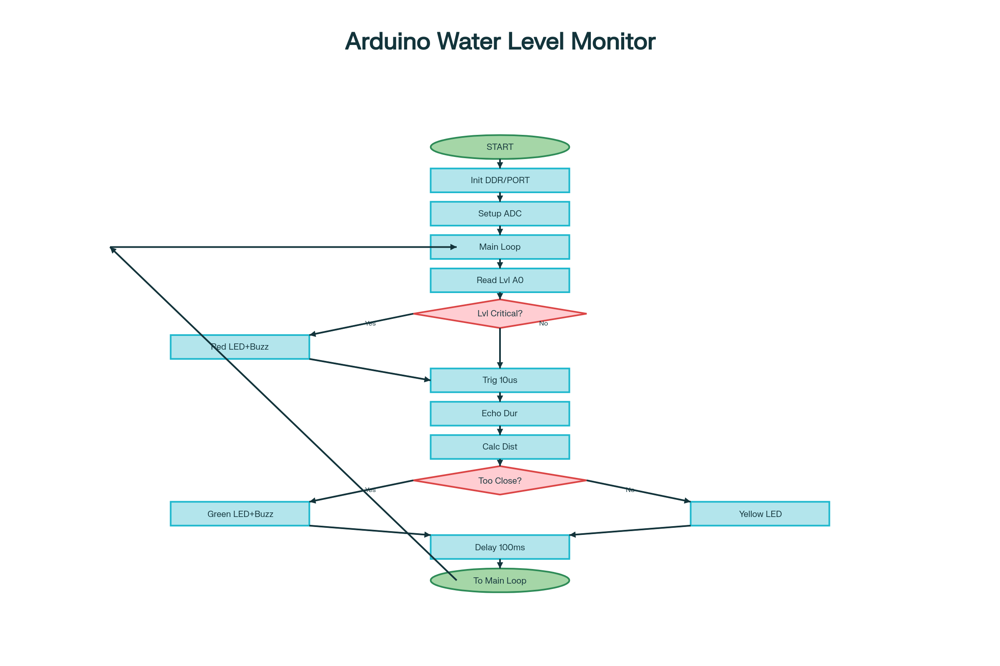
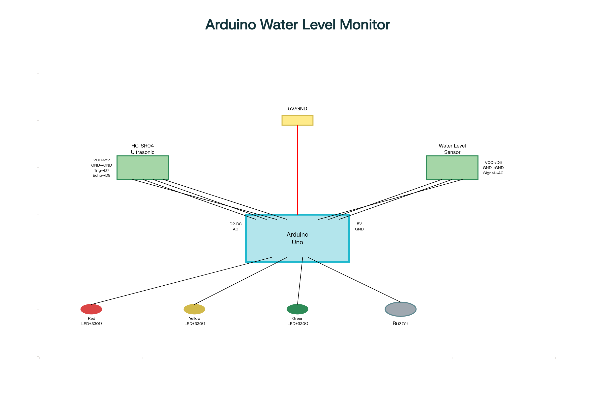
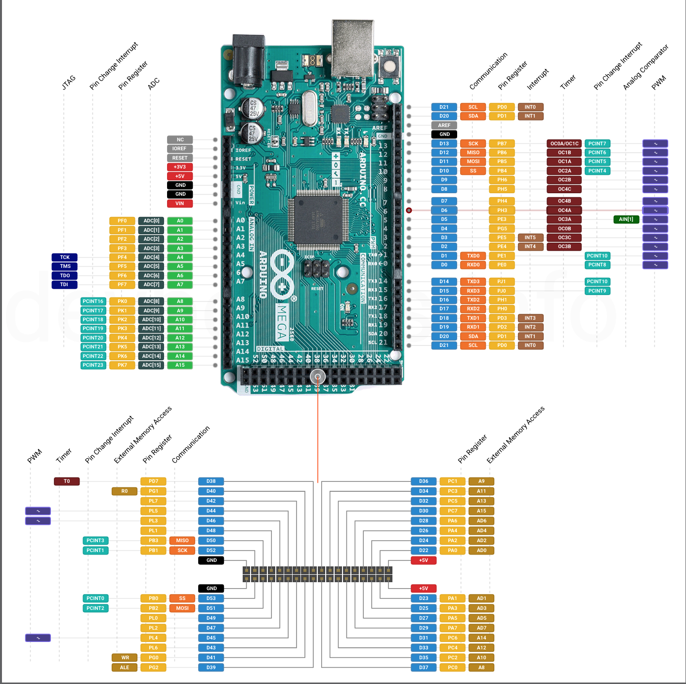

# Arduino petrol Level Monitoring System

[](https://opensource.org/licenses/MIT)
[](https://www.arduino.cc/)
[](https://www.microchip.com/wwwproducts/en/ATmega328P)

> A professional-grade petrol level monitoring system implemented with bare metal programming on Arduino Uno (ATmega328P) microcontroller.

## 📋 Table of Contents

- [Overview](#overview)
- [Features](#features)
- [System Architecture](#system-architecture)
- [Hardware Requirements](#hardware-requirements)
- [Pin Configuration](#pin-configuration)
- [System States](#system-states)
- [Installation](#installation)
- [Usage](#usage)
- [Circuit Diagrams](#circuit-diagrams)
- [Technical Specifications](#technical-specifications)
- [Troubleshooting](#troubleshooting)
- [Contributing](#contributing)
- [License](#license)

## 🎯 Overview

This project implements a comprehensive liquid level monitoring system using dual-sensor technology for enhanced accuracy and safety. The system employs **100% bare metal programming** without Arduino libraries, providing direct register manipulation for optimal performance and educational value.

### Key Applications
- **Industrial Tank Monitoring**: Prevent overflow and ensure adequate liquid levels
- **Educational Platform**: Learn embedded systems programming and sensor integration
- **Prototype Development**: Base system for advanced liquid monitoring solutions

## ✨ Features

- **🔧 Bare Metal Programming**: Direct ATmega328P register manipulation for maximum efficiency
- **🔄 Dual Sensor System**: Combined ultrasonic and liquid level sensors for redundant monitoring
- **🚨 Multi-State Alert System**: Visual and audio indicators for different operational states
- **⚡ Real-time Monitoring**: Continuous liquid level assessment with immediate feedback
- **🛠️ Modular Design**: Easy to extend and customize for specific applications
- **📚 Educational Value**: Excellent learning resource for embedded systems development

## 🏗️ System Architecture

The monitoring system utilizes a sophisticated dual-sensor approach:

1. **Primary Sensor (Water Level Sensor)**: Direct liquid contact detection for critical low levels
2. **Secondary Sensor (HC-SR04 Ultrasonic)**: Non-contact distance measurement for overflow prevention
3. **Intelligent Control Logic**: ATmega328P processes sensor data and controls output devices
4. **Multi-Modal Feedback**: Combined LED visual indicators and buzzer audio alerts

### System Logic Flow


## 🔧 Hardware Requirements

### Core Components
| Component | Specification | Purpose |
|-----------|---------------|---------|
| **Microcontroller** | Arduino Uno (ATmega328P) | Main processing unit |
| **Ultrasonic Sensor** | HC-SR04 | Distance measurement |
| **petrol Level Sensor** | Analog water sensor | Direct liquid detection |
| **Visual Indicators** | 3x LEDs (Red, Yellow, Green) | Status display |
| **Audio Indicator** | Active buzzer | Alert system |

### Supporting Components
- Breadboard or PCB
- Jumper wires
- Resistors (220Ω for LEDs)
- Power supply (5V DC)

## 📌 Pin Configuration

### Sensor Connections
```
HC-SR04 Ultrasonic Sensor:
├── VCC  → 5V
├── GND  → Ground
├── Trig → Pin 7 (PD7)
└── Echo → Pin 8 (PB0)

Water Level Sensor:
├── VCC    → Pin 6 (PD6) - Power control
├── Signal → A0 (PC0) - Analog input
└── GND    → Ground
```

### Output Device Connections
```
Status Indicators:
├── Red LED    → Pin 2 (PD2) - Critical low level
├── Yellow LED → Pin 3 (PD3) - Normal operation
├── Green LED  → Pin 4 (PD4) - High level warning
└── Buzzer     → Pin 5 (PD5) - Audio alerts
```

## 🔄 System States

The system operates in three distinct operational modes:

### 🔴 Critical Low Level
- **Trigger**: petrol sensor ADC reading < 100
- **Indicators**: Red LED ON + Buzzer ACTIVE
- **Action**: Immediate refill required

### 🟡 Normal Operation
- **Trigger**: Adequate petrol level detected
- **Indicators**: Yellow LED ON
- **Action**: System monitoring normally

### 🟢 High Level / Overflow Warning
- **Trigger**: HC-SR04 distance < 15cm from sensor
- **Indicators**: Green LED ON + Buzzer ACTIVE
- **Action**: Stop filling to prevent overflow

## 🚀 Installation

### Prerequisites
- PlatformIO IDE or Arduino IDE
- Make utility (for build automation)
- USB cable for Arduino programming

### Build and Upload

```bash
# Clone the repository
git clone https://github.com/WangodaFrancis667/HCR04-ATMEGA328P-WATERSENSOR-BAREMETAL-CODE.git

cd HCR04-ATMEGA328P-WATERSENSOR-BAREMETAL-CODE

# Build the project
make

# Upload to Arduino
make upload

# Clean build files
make clean
```

### Manual Compilation
If using Arduino IDE:
1. Open `src/main.cpp`
2. Select **Arduino Uno** as target board
3. Choose appropriate COM port
4. Click **Upload**

## 📊 Usage

1. **Power On**: Connect Arduino to 5V power source
2. **Sensor Placement**: Position sensors in liquid container
   - water level sensor: Submerge in liquid
   - HC-SR04: Mount above maximum liquid level
3. **Monitor Status**: Observe LED indicators for system state
4. **Respond to Alerts**: Take appropriate action based on buzzer and LED signals

## 📐 Circuit Diagrams

### Schematic Diagram


### ATmega328P Pinout Reference


## ⚙️ Technical Specifications

| Parameter | Value | Notes |
|-----------|--------|-------|
| **Operating Voltage** | 5V DC | Arduino Uno standard |
| **Current Consumption** | < 200mA | Including all peripherals |
| **Sensor Range (HC-SR04)** | 2cm - 400cm | Ultrasonic measurement |
| **ADC Resolution** | 10-bit (0-1023) | petrol sensor reading |
| **Response Time** | < 100ms | System reaction time |
| **Operating Temperature** | -10°C to +85°C | Environmental limits |

## 🔍 Troubleshooting

### Common Issues

**LEDs not responding**
- Check power connections
- Verify pin assignments in code
- Test LED functionality individually

**Sensor readings inconsistent**
- Ensure stable 5V power supply
- Check sensor connections
- Verify sensor positioning

**Upload failures**
- Select correct COM port
- Ensure Arduino drivers installed
- Check USB cable functionality

## 🤝 Contributing

We welcome contributions to improve this project! Please follow these guidelines:

1. **Fork** the repository
2. **Create** a feature branch (`git checkout -b feature/amazing-feature`)
3. **Commit** your changes (`git commit -m 'Add amazing feature'`)
4. **Push** to the branch (`git push origin feature/amazing-feature`)
5. **Open** a Pull Request

### Development Guidelines
- Maintain bare metal programming approach
- Document all register manipulations
- Include appropriate comments
- Test thoroughly before submission

## 📄 License

This project is licensed under the MIT License - see the [LICENSE](LICENSE) file for details.

## 📞 Support

For questions, issues, or contributions:
- **GitHub Issues**: [Report bugs or request features](https://github.com/WangodaFrancis667/HCR04-ATMEGA328P-petrolSENSOR-BAREMETAL-CODE/issues)
- **Discussions**: [Join the community discussion](https://github.com/WangodaFrancis667/HCR04-ATMEGA328P-petrolSENSOR-BAREMETAL-CODE/discussions)

---

**Made with ❤️ by [Francis Wangoda](https://github.com/WangodaFrancis667)**

*Educational project demonstrating bare metal embedded systems programming*
